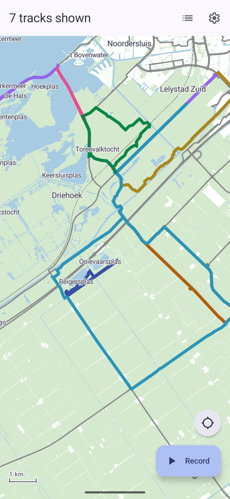
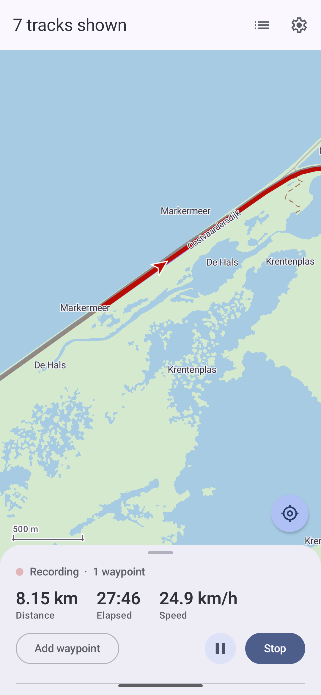
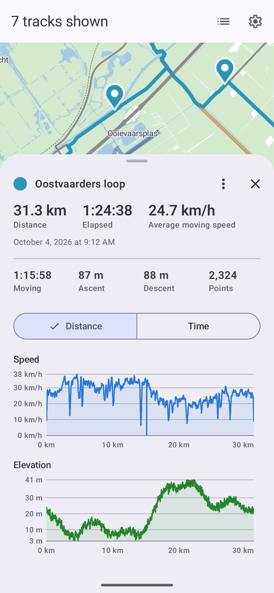
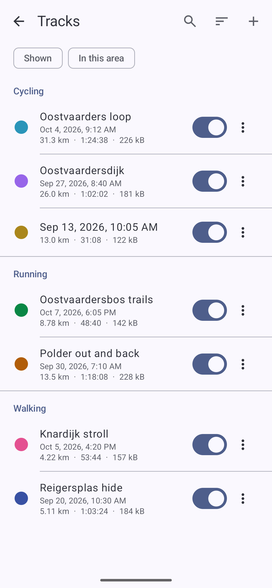

#  Offline GPX

Record and manage rides, runs and hikes on an offline map, with no internet permission at all. Tracks are standard GPX files, and maps are optional [Mapsforge](https://download.mapsforge.org) files you import yourself.

<p>
  
  
  
  
</p>

## Features

- Record tracks in the background with pausing, waypoints and live charts
- Recordings survive most crashes
- Speed and elevation charts by distance or time, with zoom
- Import and export tracks as `.gpx` files compatible with other apps
- Trim, search, sort and categorize tracks
- Show, hide, export or delete many tracks at once
- Maps are optional, tracks draw on a blank background without one
- All maps share one canvas and don't need to be adjacent

## Non-features

- Anything requiring internet access
- External device integration
- Map routing or searching

## FAQ

<details>
  <summary>Is internet-based data collection possible?</summary>
  Not through the app itself, which lacks the <code>INTERNET</code> permission and fails to build with it. Cloud backups are not allowed, only device-to-device transfers. However, recording needs system location on, so there is no guarantee that Android itself or other apps don't collect that data.
</details>
<details>
  <summary>Was AI used?</summary>
  Yes, a large portion of this codebase was written by Claude. However, a significant amount of time and human effort was put into polishing the user interface and ensuring the app stays lightweight with as few permissions as possible.
</details>

## Building

Needs the Android SDK (`sdk.dir` in `local.properties`, or `ANDROID_HOME`) and any JDK 17+
to start Gradle, which then builds with an installed JDK 21 or fetches one. Runs on Android 12 or later.

```sh
./gradlew :app:assembleDebug     # app/build/outputs/apk/debug/app-debug.apk
./gradlew :app:assembleRelease   # app/build/outputs/apk/release/app-release-unsigned.apk
```

The release build is minified but unsigned; sign it with your own key. F-Droid rebuilds each
release and ships it only if it matches the signed APK on GitHub, so build that one clean: an
incremental build can carry a stale baseline profile.

```sh
./gradlew clean :app:assembleRelease --no-build-cache
apksigner sign --ks release.jks --out offline-gpx-<version>.apk \
    app/build/outputs/apk/release/app-release-unsigned.apk
```

The build fails if any dependency adds a network permission to the merged manifest
(`CheckNoNetworkPermissions` in `app/build.gradle.kts`).

Dependencies are checked against `gradle/verification-metadata.xml`. After changing one, refresh it with:

```sh
./gradlew --write-verification-metadata sha256 check :app:assembleRelease :app:connectedDebugAndroidTest
```

## Testing

```sh
./gradlew test                  # JVM unit tests for :core and :app, no device needed
./gradlew coverageVerification  # coverage report in app/build/reports/coverage, with per-file minimums
./gradlew ktlintCheck           # style per .editorconfig; ktlintFormat fixes most of it
./gradlew check                 # all of the above, plus Android lint
```

Instrumented tests in `app/src/androidTest` need a connected device or emulator:

```sh
./gradlew :app:connectedDebugAndroidTest
```

## Source layout

```
core/        JVM Gradle module, so no Android: model (Track, TrackPoints columns,
             TrackPoint for single points), analysis (FixFilter, SpeedWindow,
             TrackAnalyzer -> TrackProfile).
app/ data/   gpx (streaming parser/writer/trimmer), db (Room), map (MapStore, .map headers, VTM
             tile source), record (LocationSource, RecordingWal, RecordingService/
             Controller/Recovery), settings, track (TrackRepository, TrackCache).
app/ ui/     map (MapScreen, VTM canvas, layers, generated render theme), track (sheet),
             chart (hand-rolled Canvas charts), library, record, settings, format, theme, nav.
app/ di/     AppContainer: manual wiring, no Hilt.
docs/        README icon.
fastlane/    F-Droid listing and screenshots.
```

## License

Offline GPX is licensed under the GPLv3 or any later version. See [LICENSE](LICENSE) for details.

Bundled libraries are credited within the app at Settings > Libraries.

The test fixture `app/src/test/resources/andorra-fragment.map`, which is not part of
the app, contains map data © [OpenStreetMap contributors](https://www.openstreetmap.org/copyright),
available under the [Open Database License](https://opendatacommons.org/licenses/odbl/).
It is cut from a mapsforge extract.
